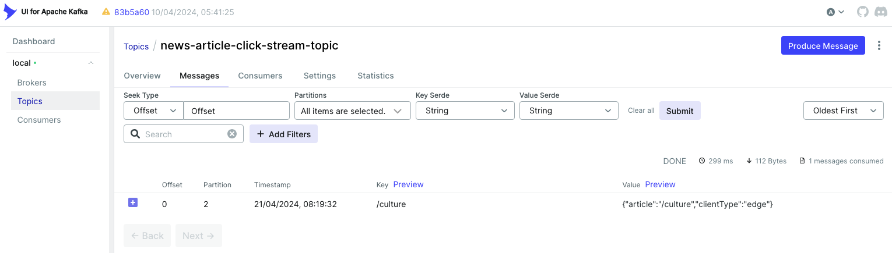

## Web API Kafka Producer  

This is a Spring Boot project, it contains the api that will be invoked when a news article is requested.  
The API in this project can be invoked either from api gateway or another service that serves the news article.  
The API call will immediately log the event in kafka and free up the synchronous communication that is typing up user's request.  
This project creates 4 docker containers at runtime:  
* web-api-kafka-producer : This is the web api container that listens for http requests at port 80
* kafka-ui : This is Kafka dashboard UI, to view into kafka cluster
* kafka : This is kafka broker container. We are using just one kafka broker (to keep our example problem focused on problem statement)  
* zookeeper : This is needed by kafka.  

#### Steps to build the project  
`mvn clean package` to build our application jar file   
`docker compose build` to create docker image with our latest application jar file  
`docker compose -f docker-compose.yml up -d`, we use `-d` to run in detached mode, remove this flag to run in foreground mode  
`docker compose down` to stop kafka docker services  
Topic will be automatically created

#### Kafka UI  
We have installed another container to view our kafka queue in docker. Visit the url on your machine http://localhost:8090/  

Send your first message by clicking this link : http://localhost/generate-events/1  
This is how the dashboard looks like, after sending the first message.  

##### Troubleshooting  

* If you get an error like `no main manifest attribute, in web-api-kafka-producer.jar
  ` then visit the below link and follow steps  
https://www.baeldung.com/spring-boot-fix-the-no-main-manifest-attribute  
* How to connect to Apache Kafka in docker `https://www.youtube.com/watch?v=L--VuzFiYrM`  

